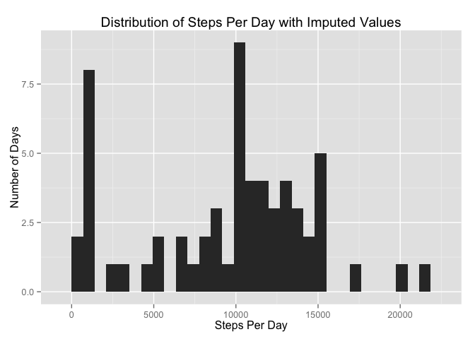

# Reproducible Research: Peer Assessment 1
James Sims  
#### Summary
The purpose of this project is to become familiar with implementing the integration of explanatory text and programming code using Rmarkdown as the text formatting system and R code chunks as the computer language.  The PA_1_template.Rmd document contains all the explanatory text and programming code for the project.

The project uses a URL supplied by the course director for this assignment to download the dataset.  The dataset was used to answer various questions posed by the instructor for this exercise.    
 

#### Computing Enviornment
Language: R version 3.2.0 (2015-04-16) -- "Full of Ingredients"  
IDE:  RStudio Version 0.99.441  
Platform: x86_64-apple-darwin13.4.0 (64-bit)  

R package  |    Version     |     How used
---------- |--------------- | ---------------------------------------------------------------------------------
dplyr      |      0.4.1     |    supplies functions:  arrange(), filter(), group_by(), mutate() and summarise()
ggplot2    |      1.0.1     |    supplies functions for plotting data 
knitr      |     1.10.5     |    combine Rmarkdown text and code chunks and save to html


#### Loading and preprocessing the data  

After setting up a convenient method to assemble file paths, the data was 
downloaded using the URL provided by the instructor. The data was in the zip 
archive format.  The downloaded zip file was unzipped and the contents saved to 
disk. After the contents were unzipped, the zip file was then deleted from disk. 


```r
# set your base directory to suit your preference; 
# baseDir provides part of the path to files
setwd("~/git/repdata-031/RepData_PeerAssessment1")                                    
baseDir <- getwd() 

theURL <- "https://d396qusza40orc.cloudfront.net/repdata%2Fdata%2Factivity.zip"
download.file(theURL, destfile = paste(baseDir,"activity.zip",sep = "/"),
              method = "curl")

zippedFileList <- unzip(paste(baseDir,"activity.zip", sep = "/"),list = TRUE)

for(i in 1:nrow(zippedFileList)){
        unzip(paste(baseDir,"activity.zip",sep = "/"),zippedFileList$Name[i])
}

if(file.exists(paste(baseDir,"activity.zip", sep = "/"))){
        file.remove(paste(baseDir,"activity.zip", sep = "/"))
} 
```

```
## [1] TRUE
```
The result was a single file named activity.csv. 

Next, the data was read into an R dataframe named rawActivity with the option
stringsAsFactors set to FALSE to avoid the read.csv function coercing character 
variables to factors.


```r
# load data
if(file.exists(paste(baseDir,zippedFileList$Name[1], sep = "/"))){
        rawActivity <- read.csv(paste(baseDir,zippedFileList$Name[1],
                                      sep = "/"),stringsAsFactors = FALSE)
}
```

Inspection of the rawActivity dataframe showed that it consisted of 17568 observations of 3 variables. The *date* variable was a character variable, not a date variable.   
 

```r
summary(rawActivity)
```

```
##      steps            date              interval     
##  Min.   :  0.00   Length:17568       Min.   :   0.0  
##  1st Qu.:  0.00   Class :character   1st Qu.: 588.8  
##  Median :  0.00   Mode  :character   Median :1177.5  
##  Mean   : 37.38                      Mean   :1177.5  
##  3rd Qu.: 12.00                      3rd Qu.:1766.2  
##  Max.   :806.00                      Max.   :2355.0  
##  NA's   :2304
```
So, it was necessary to convert the *date* variable to a date class variable that R can work with. The rawActivity dataframe was first copied to a dataframe named processedActivity, then the *date* format was fixed and saved in the processedActivity dataframe, leaving the rawActivity dataframe unchanged.


```r
processedActivity <- rawActivity
processedActivity$date <- as.Date(processedActivity$date,"%Y-%m-%d")            
```


#### What is the mean total number of steps taken per day?

Because the *steps* variable contained NA values (missing data, see above), it was necessary to remove these observations in order to avoid errors in calculations.  This was accomplished by subsetting the processedActivity dataframe using the complete.cases() function and saving the resulting dataframe as daily_steps_no_NAs.


```r
daily_steps_no_NAs <- processedActivity[complete.cases(processedActivity),]
```

The R package dplyr was loaded to conveniently provide functions to first group the activity data by date, and then summarize the data by calculating the sum of steps for each date and storing the result in the daily_step_sums dataframe.  


```r
library(dplyr) 
```

```
## 
## Attaching package: 'dplyr'
## 
## The following object is masked from 'package:stats':
## 
##     filter
## 
## The following objects are masked from 'package:base':
## 
##     intersect, setdiff, setequal, union
```

```r
daily_step_sums <- group_by(daily_steps_no_NAs, date) %>%
        summarize(sum(steps))
#fix variable name for dplyr generated summarized variable
colnames(daily_step_sums) <- c("date","dailystepsum")
```

The daily_step_sums dataframe consists of 53 observations corresponding to the total number of different dates for which there was recorded activity data.  

The distribution of steps per day is shown below in a histogram.  For this particular plot, the ggplot2 package of R functions was used.  


```r
library(ggplot2)
qplot(daily_step_sums$dailystepsum, geom = "histogram", 
      main = "Distribution of Steps Per Day",
      xlab = "Steps Per Day", ylab = "Number of Days")
```

```
## stat_bin: binwidth defaulted to range/30. Use 'binwidth = x' to adjust this.
```

 

Next, the mean and median was calculated for the number of steps per day using base R functions. To a first approximation, the steps per day is normally distributed (median and mean almost equal).

```r
print(paste("Mean total number of steps per day = ",
            mean(daily_step_sums$dailystepsum)))
```

```
## [1] "Mean total number of steps per day =  10766.1886792453"
```

```r
print(paste("Median total number of steps per day = ",
            median(daily_step_sums$dailystepsum)))
```

```
## [1] "Median total number of steps per day =  10765"
```


#### What is the average daily activity pattern?
The processedActivity dataframe was subsetted to remove intervals with missing step data and the result was saved as a dataframe named intervalAverages. The data in intervalAverages was first grouped by interval, then the mean of each interval was calculated and the results saved into the intervalAverages dataframe.  A graph of average number of steps vs. interval is shown below in a type "l" plot.


```r
intervalAverages <- processedActivity[complete.cases(processedActivity),]
intervalAverages <- group_by(intervalAverages, interval) %>%
        summarise(mean(steps))
# fix variable name created by dplyr
colnames(intervalAverages) <- c("interval","meansteps")
plot(intervalAverages$interval,intervalAverages$meansteps, type = "l", 
     main = "Average Number of Steps Per 5-Minute Time Interval", 
     xlab = "Interval", ylab = "Average Number of Steps")
```

 

Next, calculations were performed to determine which daily activity interval most often contained the maximum number of steps. The processedActivity dataframe was subsetted to remove missing values. Next, a dataframe called maxsteps with one observation (row) for each date and the maximum steps that ocurred in any interval that date was created using functions from the dplyr package.  The dplyr mutate() function was used to add an additional variable to the maxsteps dataframe which will be used to subsequently record the interval number corresponding to the maximum value for that date.  

```r
dailypattern <- processedActivity[complete.cases(processedActivity),]
maxsteps <- group_by(dailypattern,date) %>%
        summarise(max(steps))
maxsteps <- mutate(maxsteps,theinterval = NA)
```

Next, a small function was written to perform a lookup of the interval containing the maximum number of steps for a given date.  It was used to populate the variable *theinterval* in the maxsteps dataframe.  

```r
# function to look up interval with the maximum step value for a given date
getRowInfo <- function(theDate){
 temp <- filter(dailypattern, date == theDate) %>%
        arrange(desc(steps))
 temp$interval[1]
}
# look up the intervals and record in maxsteps dataframe
for(i in 1:nrow(maxsteps)){
        maxsteps$theinterval[i] <- getRowInfo(maxsteps$date[i])
}
```
A few additional calcuation steps were needed to determine the mode (most frequent) of the interval with the daily maximum steps. 

```r
# I found this method for calculating the mode by Curtis Kephart posted here:  
# http://www.cazaar.com/ta/econ113/mode-code-for-r
temp <- table(as.vector(maxsteps$theinterval))
theMode <- names(temp)[temp == max(temp)]
print(paste("The most frequent interval for the maximum number of steps per day is ",
            theMode,".",sep=""))
```

```
## [1] "The most frequent interval for the maximum number of steps per day is 815."
```


### Imputing missing values
The rawActivity dataset was examined for missing data.

```r
print(paste("The number of rows with missing data is ",
            nrow(rawActivity[!complete.cases(rawActivity),]),".",sep=""))
```

```
## [1] "The number of rows with missing data is 2304."
```

To fill in the missing data, the following strategy was used.  First, the processedActivity dataframe was used to generate one dataframe with all the observations with missing data (imputedData), and another dataframe with only the complete observations (completeData).  Median values for the number of steps for a given interval was calculated using data in completeData dataframe and the median values copied to the appropriate rows in the imputedData dataframe.  The imputedData and completeData dataframes were then combined into a dataframe called combinedImputedComplete. Next, combinedImputedComplete data was grouped by date, summarized by the number of steps per day and the results stored in a new dataframe daily_step_sumsCombined. Variable names were fixed, and a histogram of steps per day with imputed values was constructed as shown below.  Below the histogram, the average and mean steps per day was calcuated


```r
imputedData <- processedActivity[!complete.cases(processedActivity),]
completeData <- rawActivity[complete.cases(processedActivity),]

for(i in 1:nrow(imputedData)){
        imputedData$steps[i] <- median(completeData$steps[completeData$interval == imputedData$interval[i]])
}
combinedImputedComplete <- rbind(imputedData, completeData)
combinedImputedComplete$date <- as.Date(combinedImputedComplete$date)
daily_step_sumsCombined <- group_by(combinedImputedComplete, date) %>%
        summarize(sum(steps))
#fix variable name for dplyr generated summarized variable
colnames(daily_step_sumsCombined) <- c("date","dailystepsum")

qplot(daily_step_sumsCombined$dailystepsum, geom = "histogram", 
      main = "Distribution of Steps Per Day with Imputed Values",
      xlab = "Steps Per Day", ylab = "Number of Days")
```

```
## stat_bin: binwidth defaulted to range/30. Use 'binwidth = x' to adjust this.
```

 

```r
print(paste("The mean value for the number of steps per day with imputed values was ", 
            mean(daily_step_sumsCombined$dailystepsum),".",sep=""))
```

```
## [1] "The mean value for the number of steps per day with imputed values was 9503.86885245902."
```

```r
print(paste("The median value for the number of steps per day with imputed values was ", 
            median(daily_step_sumsCombined$dailystepsum),".",sep=""))
```

```
## [1] "The median value for the number of steps per day with imputed values was 10395."
```
The process of imputing missing values resulted in a dataframe of 61 summarized observations.  This was 8 additional observations (additional dates) compared to the summarized observations without imputing missing values.  As shown above, the process of imputing missing values dramatically lowered both the mean and the median of the dataset compared to the dataset without imputed values. The mean and median values are further apart using imputed data, indicating imputed values skewed the distribution to the left, which is confirmed by the histogram of the steps per day with imputed values.

#### Are there differences in activity patterns between weekdays and weekends?
Because imputed values changed the distribution of the dataset, and because there were no assignment instructions one way or the other as to which dataset (original or imputed) to use for this subsection of the assignment, the activity patterns for the weekdays and weekends here are data without imputed values, namely the dailypattern dataframe as described above.

An additional variable *daytype* was created for the dataframe dailypattern dataframe. The weekdays() function was used to initally populate the *daytype* variable with the name of the day of the week for each date in the dataset, then the names of the days of the week were replaced by "weekend"" and "weekday"" as appropriate. 


```r
# subset data, add variables and calculate weekends and weekdays
activityPattern <- processedActivity[complete.cases(processedActivity),]
activityPattern <- mutate(activityPattern,daytype = NA)
activityPattern$daytype <- weekdays(activityPattern$date)
aweekday <- c("Monday", "Tuesday", "Wednesday", "Thursday", "Friday")
aweekend <- c("Saturday", "Sunday")
for(i in 1:nrow(activityPattern)){
      if(activityPattern$daytype[i] %in% aweekday){
              activityPattern$daytype[i] <- "weekday"
      }  
        if(activityPattern$daytype[i] %in% aweekend){
              activityPattern$daytype[i] <- "weekend"
      }  
}
```
An additional variable was added to the activityPattern dataframe to hold the mean number of steps for a given interval.  The activityPattern dataframe was subsetted so that a new dataframe held the weekend observations and a different dataframe held the weekday observations.  Interval averages were calculated separately for each dataframe and then the weekend and weekday dataframes were combind.   

```r
# add variable to hold average steps per interval; fix variable type
activityPattern <- mutate(activityPattern,meansteps = NA)
theIntervalNames <- unique(activityPattern$interval)
activityPattern$daytype <- as.character(activityPattern$daytype)

# create a weekday and a weekend dataframe; calculate interval averages
activityPattern_weekdays <- activityPattern[activityPattern$daytype 
                                            == "weekday", ]
for(j in 1:length(theIntervalNames)){
        aMean <- mean(activityPattern_weekdays$steps[activityPattern_weekdays$interval 
                                                == theIntervalNames[j]])
        activityPattern_weekdays$meansteps[activityPattern_weekdays$interval 
                                   == theIntervalNames[j]] <- aMean
}
activityPattern_weekends <- activityPattern[activityPattern$daytype 
                                            == "weekend", ]
for(j in 1:length(theIntervalNames)){
        aMean <- mean(activityPattern_weekends$steps[activityPattern_weekends$interval 
                                                == theIntervalNames[j]])
        activityPattern_weekends$meansteps[activityPattern_weekends$interval 
                                   == theIntervalNames[j]] <- aMean
}
# combine weekday and weekend dataframes
activityPattern <- rbind(activityPattern_weekdays,activityPattern_weekends)
```
The *daytype* variable was changed to a factor variable and then panel plots were made with using the ggplot2 package for the average (mean) steps for each interval by interval.  As can be seen in the plots, there was a tendency to be somewhat less active on the weekends before interval 1000 compared to the weekdays, and there was a tendency to be more active between intervals 1000 and about 1750 on the weekends compared to the weekdays. 

```r
# change daytype to a factor variable
activityPattern$daytype <- as.factor(activityPattern$daytype)

# make panel plots
gg <- ggplot(activityPattern,aes(interval,meansteps)) 
gg <- gg + geom_line() + facet_wrap(~daytype,ncol=1) 
gg <- gg + ggtitle("Activity without Imputed Data") 
gg <- gg + labs(x = "Interval", y = "Average Number of Steps")
gg
```

 
